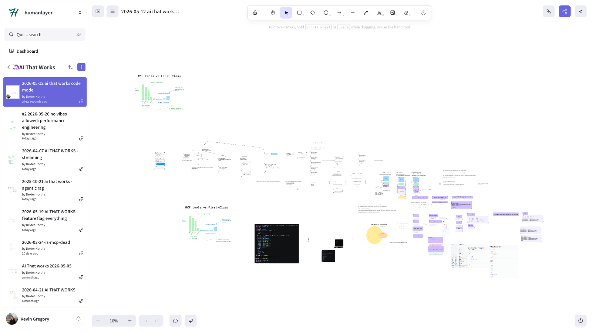

# 🦄 ai that works: "Code Mode" Deep Dive

> A deep dive into the evolution of AI tool-calling: from inline tools and MCPs to CLIs, Bash, and the emerging "code mode" paradigm where agents write and execute real code to call their tools.

[Video](https://www.youtube.com/watch?v=0dx3j4CmSFw) (1h5m)

Links:

- [Session Code](https://github.com/ai-that-works/ai-that-works/tree/main/2026-05-12-code-mode-deep-dive)

## Episode Highlights

> "Rewrite it as a program. We went from bespoke tools to bash and that was good, but now we're trying to make it do more bash — and we all know that's like a 500-line bash script. Code mode is the next step after bash."

> "Tool calls are primitives. Bash is an implementation of the primitives, code mode is an implementation of the primitives. Don't overindex on either. Whatever the next best format is, you can make your tool catalog callable in that format."

> "The best thing you can do as a company is have a really good OpenAPI spec — because then you can convert that into a CLI, code mode, or whatever comes next."

> "CLIs are for humans, not agents. The tab autocomplete is the tell. Agents don't use tab."

> "Code mode really shines for agents that can run serverlessly, don't require a full VM, and need access to a huge number of tools."

> "Context bloat with MCPs is not real. It's a harness implementation problem, not an MCP problem."

## Key Takeaways

- **Tool calls are the primitive, everything else is an implementation.** MCP, Bash, CLIs, and code mode are all just different ways of expressing "name + input + output." When you realize that, you stop arguing about which one is right and start thinking about which one fits the context. Bash is great today. Code mode is better for agents at scale. Something else might be better in six months.
- **Code mode's biggest win is output shaping.** In bash, getting only the PR URL from `gh pr create` means piping through `jq` and hoping the model remembers to do it — and if it forgets, you just burned 5,000 tokens of noise. In code mode, you write `const prResult = await tools.github.createPR(); console.log(prResult.url)` and only that URL goes into context. The intermediate state is invisible to the model.
- **Bash has a global state problem that sandboxes can't fully fix.** The Google CLI can only be signed into one account per machine — not per session, per machine. If you're building multi-tenant agents, you have no choice but to run full sandboxes, which adds overhead and complexity that rules out non-technical users entirely.
- **A good OpenAPI spec is the most durable investment.** If your API has a clean, well-typed OpenAPI spec, you can convert it to any execution environment: bash skills, code mode tool declarations, MCP servers. The spec is stable; the harness format isn't.
- **Manage a tool catalog, not a tool format.** Instead of thinking "we use bash" or "we use code mode," think "we have a catalog of tools with names, inputs, and outputs." The catalog is yours. How you expose it to the model is an implementation detail you can swap out.

## Resources

- [Session Recording](https://www.youtube.com/watch?v=0dx3j4CmSFw)
- [Discord Community](https://boundaryml.com/discord)
- Sign up for the next session on [Luma](https://lu.ma/baml)

## Whiteboards

