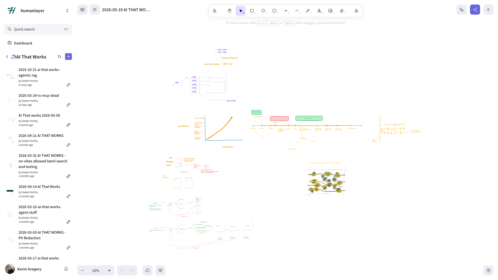

# 🦄 ai that works: Feature Flag Everything?

> A practical look at using feature flags in AI systems: when to flag models, prompts, and harnesses, and when feature flags are just an excuse to ship slop to production.

[Video](https://www.youtube.com/watch?v=gRqb7R4Pcrs)

Links:

- [Session Code](https://github.com/hellovai/ai-that-works/tree/main/2026-05-19-feature-flag-everything)

## Episode Highlights

## Key Takeaways

## Resources

- [Session Recording](https://www.youtube.com/watch?v=gRqb7R4Pcrs)
- [Discord Community](https://boundaryml.com/discord)
- Sign up for the next session on [Luma](https://lu.ma/baml)

## Whiteboards

